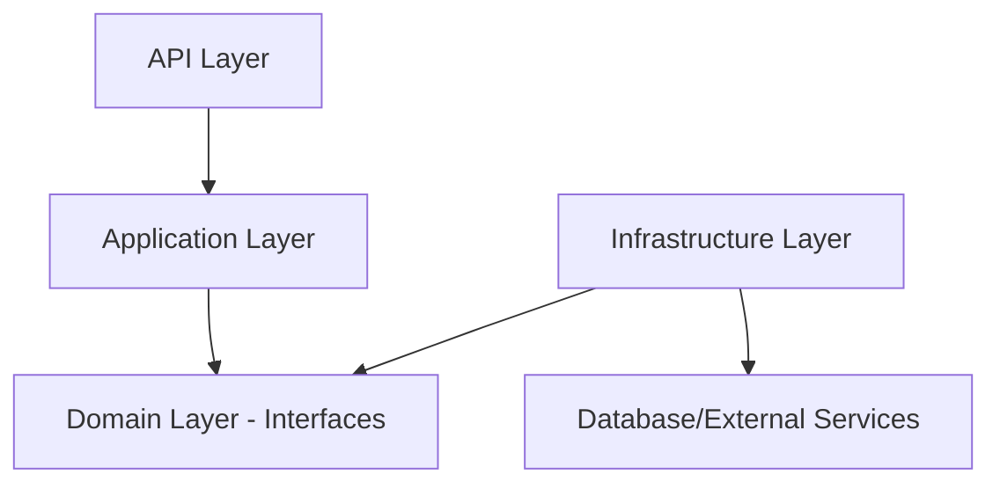

# Repository Pattern in Clean Architecture: Domain vs Infrastructure

## The Key Distinction

### 🏗️ **Domain Layer Repositories** (Interfaces/Contracts)
**Location**: `src/CoursePlatform.Domain/Repositories/`
**What they are**: `interface` definitions only
**Purpose**: Define **WHAT** operations are needed, not **HOW** they work

### 🔧 **Infrastructure Layer Repositories** (Implementations)
**Location**: `src/CoursePlatform.Infrastructure/Persistence/Repositories/`
**What they are**: `class` implementations of the interfaces
**Purpose**: Define **HOW** the operations actually work with specific technologies

## Why This Separation?

### 1. **Dependency Inversion Principle (SOLID)**
```
❌ WRONG: Domain depends on Infrastructure
[Domain] → [Infrastructure] → [Database]

✅ CORRECT: Both depend on abstractions
[Domain] → [Interfaces] ← [Infrastructure] → [Database]
```

### 2. **Technology Independence**
Your domain logic doesn't care if you use:
- Entity Framework Core
- Dapper
- MongoDB
- In-memory storage
- File system
- Web APIs

### 3. **Testability**
```csharp
// In tests, you can easily mock the interface
var mockStudentRepo = new Mock<IStudentRepository>();
mockStudentRepo.Setup(r => r.GetByIdAsync("123"))
              .ReturnsAsync(new Student { Id = "123", Name = "Test" });
```

## Real Example from Your Code

### Domain Layer (Interface - Contract)
```csharp
// Domain/Repositories/IStudentRepository.cs
public interface IStudentRepository : IGenericRepository<Student>
{
    // WHAT operations do we need?
    Task<Student?> GetByEmailAsync(string email, CancellationToken cancellationToken = default);
    Task<IEnumerable<Student>> GetActiveStudentsAsync(CancellationToken cancellationToken = default);
}
```

### Infrastructure Layer (Implementation - How it works)
```csharp
// Infrastructure/Persistence/Repositories/StudentRepository.cs
public class StudentRepository : GenericRepository<Student>, IStudentRepository
{
    // HOW do we actually get student by email using Entity Framework?
    public async Task<Student?> GetByEmailAsync(string email, CancellationToken cancellationToken = default)
    {
        return await _dbSet
            .FirstOrDefaultAsync(s => s.Email == email, cancellationToken);
    }

    // HOW do we get active students using specific SQL logic?
    public async Task<IEnumerable<Student>> GetActiveStudentsAsync(CancellationToken cancellationToken = default)
    {
        return await _dbSet
            .Where(s => s.Enrollments.Any(e => e.EnrolledOn > DateTime.UtcNow.AddMonths(-6)))
            .ToListAsync(cancellationToken);
    }
}
```

## Benefits of This Architecture

### ✅ **1. Flexibility to Change Technology**
```csharp
// Today: Entity Framework implementation
public class StudentRepository : IStudentRepository
{
    public async Task<Student?> GetByEmailAsync(string email)
    {
        return await _context.Students.FirstOrDefaultAsync(s => s.Email == email);
    }
}

// Tomorrow: Switch to Dapper without changing domain code
public class StudentRepository : IStudentRepository
{
    public async Task<Student?> GetByEmailAsync(string email)
    {
        return await _connection.QueryFirstOrDefaultAsync<Student>(
            "SELECT * FROM Students WHERE Email = @email", new { email });
    }
}

// Your Application/Domain layer code never changes!
```

### ✅ **2. Easy Testing**
```csharp
// Unit test without database
public async Task Should_Get_Student_By_Email()
{
    // Arrange
    var mockRepo = new Mock<IStudentRepository>();
    var expectedStudent = new Student { Email = "test@example.com" };
    mockRepo.Setup(r => r.GetByEmailAsync("test@example.com"))
            .ReturnsAsync(expectedStudent);

    var service = new StudentService(mockRepo.Object);

    // Act
    var result = await service.GetStudentByEmailAsync("test@example.com");

    // Assert
    Assert.Equal(expectedStudent, result);
}
```

### ✅ **3. Clear Separation of Concerns**

| Layer | Responsibility | Example |
|-------|---------------|---------|
| **Domain** | Business rules & contracts | "We need to find students by email" |
| **Application** | Use cases & orchestration | "When user searches, validate email then call repository" |
| **Infrastructure** | Technical implementation | "Query database using Entity Framework" |
| **API** | HTTP concerns | "Accept HTTP request, call application service" |

## Dependency Flow



### ✅ **Correct Dependencies**:
- API → Application → Domain Interfaces
- Infrastructure → Domain Interfaces
- Infrastructure → External Technologies

### ❌ **What we avoid**:
- Domain → Infrastructure (this would break clean architecture)
- Application → Infrastructure (should only depend on interfaces)

## Registration in Dependency Injection

```csharp
// Program.cs or DependencyInjection.cs
services.AddScoped<IStudentRepository, StudentRepository>();
services.AddScoped<ICourseRepository, CourseRepository>();
services.AddScoped<IUnitOfWork, UnitOfWork>();

// Application layer receives the interface, gets the implementation
public class StudentService
{
    private readonly IStudentRepository _studentRepository; // Interface!
    
    public StudentService(IStudentRepository studentRepository)
    {
        _studentRepository = studentRepository; // Gets StudentRepository implementation
    }
}
```

## Multiple Implementations Example

You could have multiple implementations of the same interface:

```csharp
// Domain layer - one interface
public interface IStudentRepository { ... }

// Infrastructure layer - multiple implementations
public class EfStudentRepository : IStudentRepository { ... }      // Entity Framework
public class DapperStudentRepository : IStudentRepository { ... }  // Dapper
public class InMemoryStudentRepository : IStudentRepository { ... } // Testing
public class ApiStudentRepository : IStudentRepository { ... }     // External API

// Switch implementations based on configuration
if (useEntityFramework)
    services.AddScoped<IStudentRepository, EfStudentRepository>();
else if (useDapper)
    services.AddScoped<IStudentRepository, DapperStudentRepository>();
```

## Summary

| Aspect | Domain Repositories | Infrastructure Repositories |
|--------|-------------------|---------------------------|
| **Type** | `interface` | `class` |
| **Purpose** | Define contracts (WHAT) | Implement behavior (HOW) |
| **Dependencies** | Only domain entities | External technologies |
| **Testing** | Easy to mock | Harder to test (needs database) |
| **Changes** | Rarely change | May change with technology |
| **Location** | Domain layer | Infrastructure layer |

## The Bottom Line

**You need both because**:
1. **Domain interfaces** = Business requirements (what operations do we need?)
2. **Infrastructure implementations** = Technical solutions (how do we actually do it?)

This separation allows your business logic to be independent of technical decisions, making your application more flexible, testable, and maintainable! 🎯
